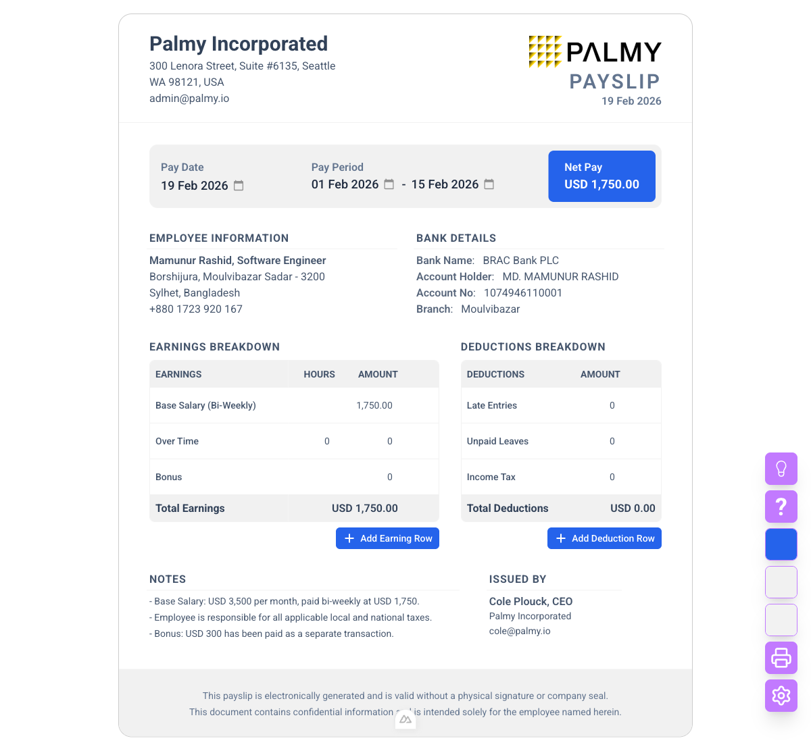

# Contractor Payment Statement Generator

An interactive, in-browser generator for a **Monthly Contractor Payment Statement**
(payslip / payment record) in a **single HTML file**. Every field is inline-editable, the
color theme is adjustable, and totals are calculated automatically. There is no build step,
no install, and no server — open `index.html` and start editing.

The document covers one monthly compensation period and records the individual payment
installments made against it, including installments settled in the following calendar
month. It is designed to print as a single A4 page.



## Features

- **Inline Editing**: Click any text or number to edit it in place.
- **Compensation & Withholdings**: Add/remove rows, with automatic totals.
- **Payment Details**: One row per installment (date, amount, method) with a Total Paid
  that is reconciled against the compensation payable; mismatches and missing payment
  dates are flagged on screen only.
- **Derived Values**: The payment period, the statement number (the contractor's initials
  plus `YYYYMM`, e.g. `JS202609`) and the installment row names (`September Payment #1`)
  follow the selected period, so they cannot go stale. In full-contract-month mode,
  changing the month also sets the statement date to the 3rd of the following month and
  the first two installments to the 16th of the period month and the 2nd of the following
  month. A statement number or row name you type yourself is kept as written.
- **Payment Period Formats**: Full contract month (default), date range, single date, or
  month & year only.
- **Account Masking**: The bank account number prints as `XXXX XXXX 1234`; toggle it off
  in Settings to edit the stored number.
- **Theming**: Live primary/secondary/border color pickers, 7 fonts, dark mode.
- **Logo Upload**: Upload and crop a company logo (stored as a data URI).
- **Print-Ready**: A4 print stylesheet and one-click print / save as PDF.
- **Persistence**: Everything is saved to `localStorage`, with JSON export/import.
- **Zero backend**: All data stays in your browser.

## Usage

Open `index.html` in any modern browser — double-clicking the file works.

To serve it locally instead (useful if your browser restricts `file://`):

```bash
python3 -m http.server 4173
```

Then visit http://localhost:4173/index.html.

1. Click any field (company, dates, contractor, bank, notes, table cells) to edit. Changes apply on blur.
2. Use the floating color pickers or the Settings panel to adjust the theme.
3. Add rows with "Add Compensation Row" / "Add Withholding Row" / "Add Installment"; remove with the trash icon.
4. Click the printer button to print or export as PDF.

## Structure

`index.html` is fully self-contained: markup, styles, and a Vue 3 app defined with
`x-template` blocks, all in one file. The favicon and default logo are inlined as data
URIs. Only these are loaded from a CDN:

- Vue 3 (global build)
- Tailwind CSS (play CDN)
- Cropper.js (logo cropping)
- Iconify (icons)
- Google Fonts

Because of the CDN dependencies the page needs a network connection on first load.

## Deployment

Upload `index.html` to any static host — Netlify, Vercel, GitHub Pages, S3, or a plain
web server. No build command, no publish directory configuration.

## Data & Privacy

- No server is used. Data lives in your browser's `localStorage` for the page's origin.
- Use **Export JSON** in Settings to back up your data, and **Import JSON** to restore it.
- Documents saved by earlier versions are migrated to the contractor-statement structure on
  load; entered values (names, amounts, bank details) are preserved.
- **Reset Data** clears saved values and reloads the defaults.

## License

Specify your preferred license (e.g., MIT) in this section.
